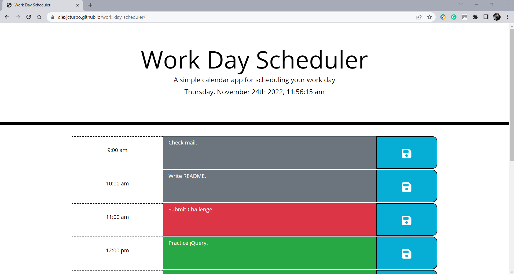
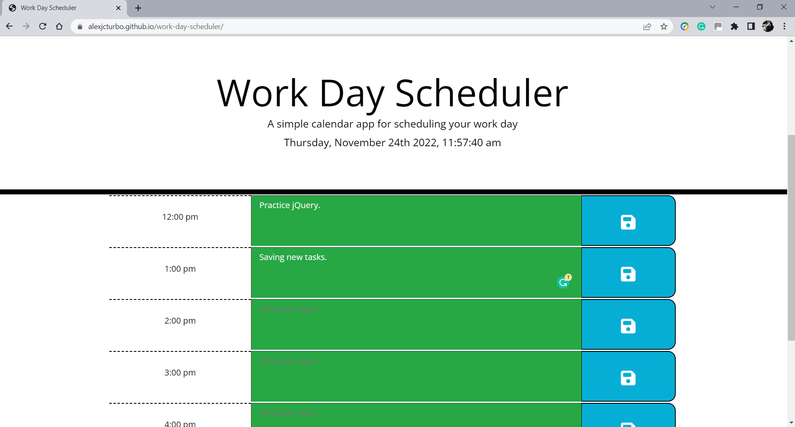
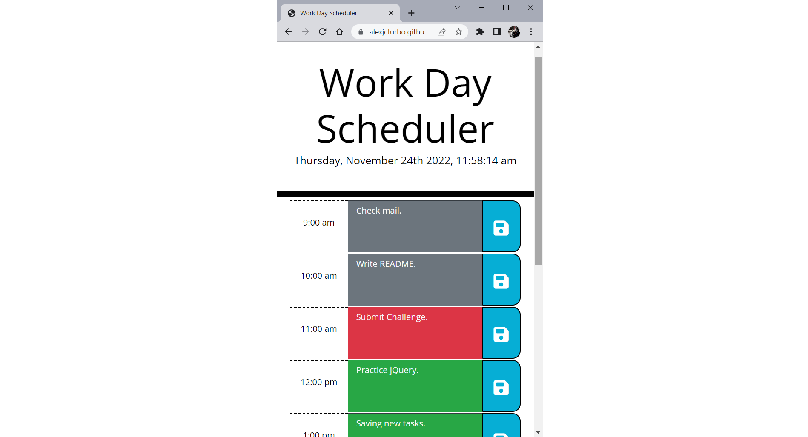

# Work Day Scheduler

## Table of Contents
- [Project Description](#Project-Description)
- [User Story](#User-Story)
- [Screen Captures](#Screen-Captures)
- [Technologies](#Technologies)
- [Links](#Links)

## Project Description
The Work Day Scheduler is a calendar application that allows the user to save events for each hour of the day. The app runs in the browser and features dynamically updated HTML and CSS powered by jQuery.

The application uses Moment.js to work with date and time. The application loads the current day and time at the top of the calendar for easy time tracking. The scheduler is structured in hourly blocks. Each time block is colour-coded to indicate whether it is in the past, present, or future. All the events are saved in the local storage so that they persist after refreshing the page.
###### [Back to Index](#Table-of-Contents)

## User Story
```
AS AN employee with a busy schedule
I WANT to add important events to a daily planner
SO THAT I can manage my time effectively
```
###### [Back to Index](#Table-of-Contents)


## Screen Captures





###### [Back to Index](#Table-of-Contents)


## Technologies


###### [Back to Index](#Table-of-Contents)

## Links
- [Deployed Application](https://alexjcturbo.github.io/work-day-scheduler/)
###### [Back to Index](#Table-of-Contents)
